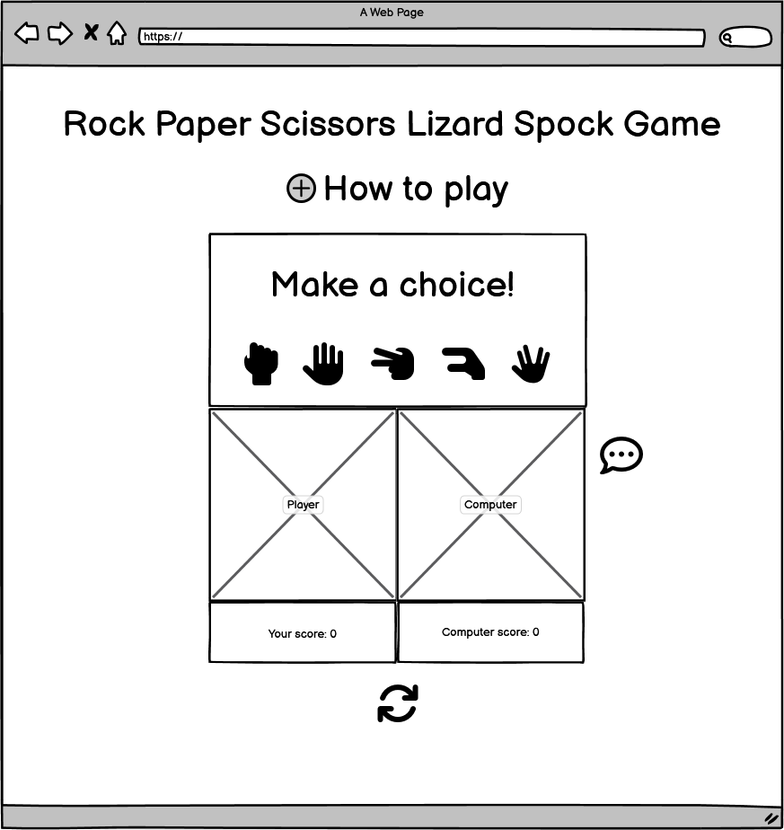
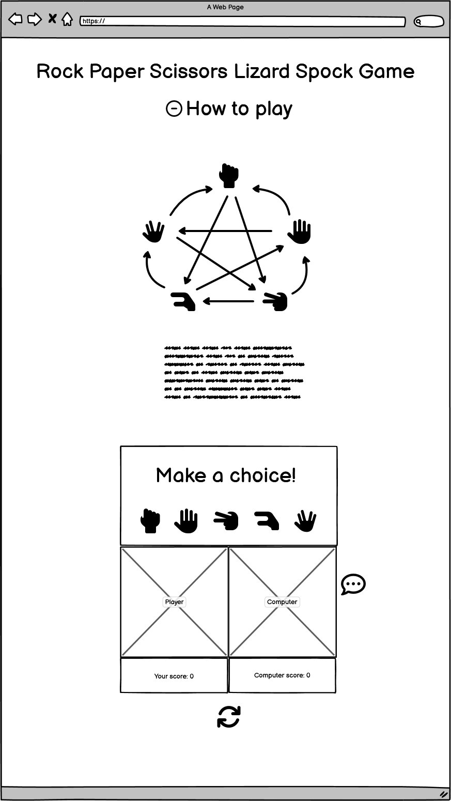
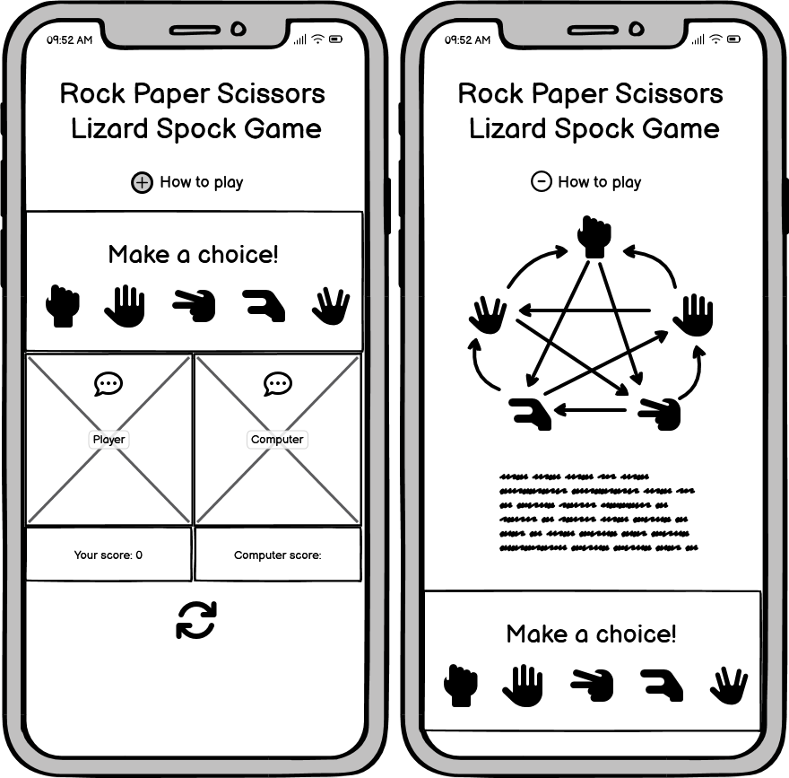

# Rock Paper Scissors Lizard Spock Game

Welcome to my Rock, Paper, Scissors, Lizard, Spock game! A game of chance where you get to test your decicion-making skills and settle disputes against your opponent, the computer. This game is based on the classic Rock, Paper, Scissors game but with two additional elements: Lizard and Spock. A twist that adds a layer of complexity and ensures less ties as an outcome.

## Rules
- Rock crushes Scissors
- Scissors cuts Paper
- Paper covers Rock
- Rock crushes Lizard
- Lizard poisons Spock
- Spock smashes Scissors
- Scissors decapitates Lizard
- Lizard eats Paper
- Paper disproves Spock
- Spock vaporizes Rock

Live Link - [Rock Paper Scissors Lizard Spock Game]()

Responsive Image - 

Table of Contents

  * [Site Owner Goals](#site-owner-goals)
  * [User Stories](#user-stories)
    + [First Time User](#first-time-user)
    + [Returning user](#returning-user)
    + [Frequent user](#frequent-user)
  * [Design](#design)
    + [Imagery](#imagery)
    + [Colour Scheme](#colour-scheme)
    + [Fonts](#fonts)
    + [Layout](#layout)
    + [Wireframes](#wireframes)
  * [Features](#features)
    + [Features Left to Implement](#features-left-to-implement)
  * [Testing](#testing)
    + [Validator Testing](#validator-testing)
      - [HTML](#html)
      - [CSS](#css)
      - [Javascript](#javascript)
      - [Accessibility](#accessibility)
    + [Input Testing](#input-testing)
    + [Button Testing](#button-testing)
    + [Game Testing](#game-testing)
    + [Browser Testing](#browser-testing)
    + [Device Testing](#device-testing)
    + [Fixed Bugs](#fixed-bugs)
    + [Known Bugs](#known-bugs)
  * [Technologies Used](#technologies-used)
    + [Languages](#languages)
    + [Frameworks - Libraries - Programs Used](#frameworks---libraries---programs-used)
  * [Deployment](#deployment)
  * [Cloning](#cloning)
  * [Credits](#credits)
    + [Content](#content)
    + [Media](#media)
    + [Resources Used](#resources-used)
  * [Acknowledgments](#acknowledgments)

## Site Owner Goals

- To provide a user friendly game which lets the user enjoy simple game mechanics.
- To present an appealing design on a fully responsive website.
- To encourage the user to win over the computer by making a decision between rock, paper, scissors, lizard and spock.
- To create a sense of competition between the user and the computer through interactive messages.

## User Stories

- ### First Time User

- ### Returning user

- ### Frequent user

## Design

### Imagery

### Colour Scheme

### Fonts
Cabin Sketch [Google Fonts](https://fonts.google.com/)

### Layout

### Wireframes

 

 
Desktop Wireframe

  
  

  
Mobile Wireframe

  

## Features

### Home Page
- Content

### How to play - Toggle
- Content

### Game area - Buttons
- Content

### Card area - winner/loser message
- Content

### Score Area - Reset score function
- Content

### Features Left to Implement
- Count down 1 rock, 2 paper, 3 sciccors, 4 Lizard, 5 spock after decision and before revealing cards - building suspense.
- Computer reaction message describing choice relationship and outcome of each turn. 
- Ability to set best of setting
- History score section
- Sounds to each button

## Testing

### Validator Testing
- #### HTML

- #### CSS

- #### Javascript

### Accessibility 

### Input Testing

### Button Testing

### Game Testing

### Browser Testing

    
### Device Testing

### Fixed Bugs

### Known Bugs

## Technologies Used

### Languages

### Frameworks - Libraries - Programs Used

## Deployment

## Cloning

## Credits

### Content

### Media

### Resources Used

## Acknowledgments
