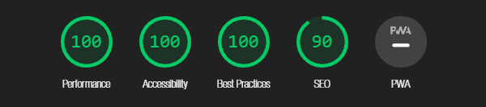
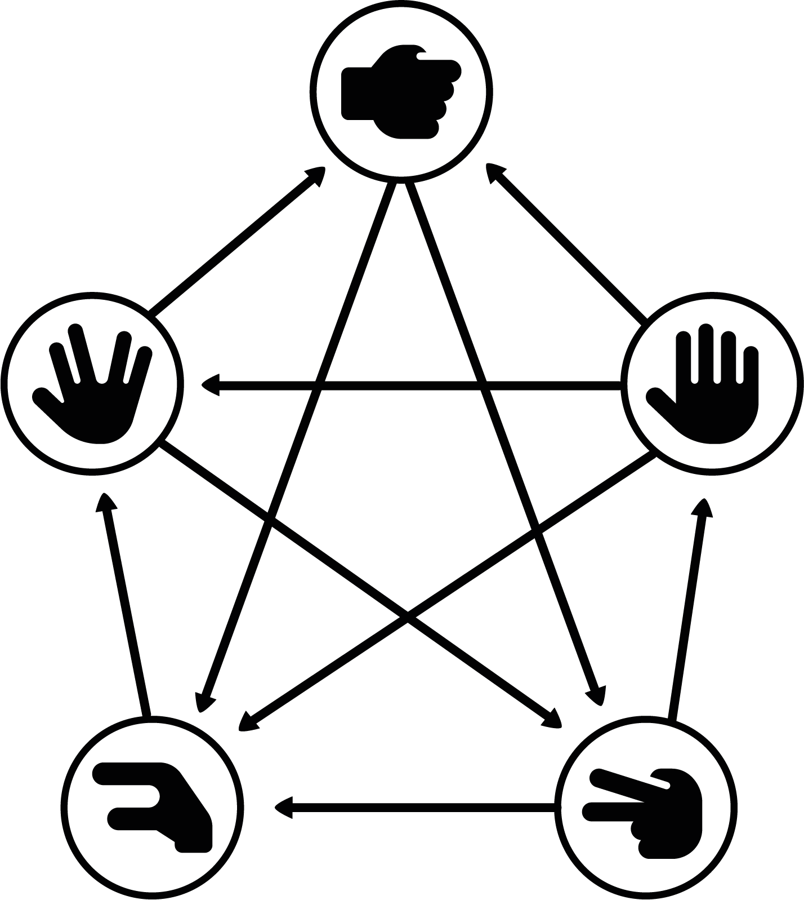

# Rock Paper Scissors Lizard Spock Game

Welcome to my Rock, Paper, Scissors, Lizard, Spock game! A game of chance where you get to test your decicion-making skills and settle disputes against your opponent, the computer. This game is based on the classic Rock, Paper, Scissors game but with two additional elements: Lizard and Spock. A twist that adds a layer of complexity and ensures less ties as an outcome.

The live link can be found here - [Rock Paper Scissors Lizard Spock Game](https://luddehs.github.io/Rock-Paper-Scissors-Lizard-Spock-Game/)

Table of Contents

  * [Site Owner Goals](#site-owner-goals)
  * [Design](#design)
    + [Fonts](#fonts)
    + [Layout](#layout)
    + [Wireframes](#wireframes)
  * [Features](#features)
    + [Features Left to Implement](#features-left-to-implement)
  * [Testing](#testing)
    + [Validator Testing](#validator-testing)
      - [HTML](#html)
      - [CSS](#css)
      - [Javascript](#javascript)
      - [Accessibility](#accessibility)
    + [Button Testing](#button-testing)
    + [Game Testing](#game-testing)
    + [Device Testing](#device-testing)
    + [Fixed Bugs](#fixed-bugs)
    + [Known Bugs](#known-bugs)
  * [Technologies Used](#technologies-used)
    + [Languages](#languages)
    + [Frameworks - Libraries - Programs Used](#frameworks---libraries---programs-used)
  * [Deployment](#deployment)
  * [Cloning](#cloning)
  * [Credits](#credits)
    + [Content](#content)
    + [Media](#media)
    + [Resources Used](#resources-used)
  * [Acknowledgments](#acknowledgments)

## Site Owner Goals

- To provide a user friendly game which lets the user enjoy simple game mechanics.
- To present an appealing design on a fully responsive website.
- To encourage the user to win over the computer by making a decision between rock, paper, scissors, lizard and spock.
- To create a sense of competition between the user and the computer through interactive messages.

## Design

The website is black and white from top to bottom. This was originally just a temporary combination, but as the site took its form the colours followed. On a white background the black icons pops and the pen and pencil text appear to be written on white paper.

### Fonts

I use the Cabin Sketch font as the main font throughout the website, giving headlines and titles consistency with playfully bold lettering. 
Nanum Brush Script is applied as a secondary font to areas where text is frequently updated, making text appear to be written out, and on lists where smaller text-size is required. All fonts were imported via [Google Fonts](https://fonts.google.com/).

Sans Serif is used as a backup if for any reason the main font won't load correctly.

### Layout
The site is a single page with 8 sections:
  - Header
  - Rules Area
  - Game Area
  - Outcome Message
  - Choice Images
  - Score Area
  - Reset game button
  - Footer

### Wireframes

I used Balsamiq as a tool to create the wireframes.

 

 
Desktop Wireframe

  
  

  
Mobile Wireframe

  

## Features

- __The Rock Paper Scissors Lizard Spock Game Heading__

  - Featured at the top of the page, the Rock Paper Scissors Lizard Spock Game Heading is easy to see and catches the user's attention. Upon entering the page, the user will be able to see the game's name.

- __The Rules Area__

- By clicking on the Rules button the area will toggle down and reveal the rules of the game together with an image explaining the mechanics of the game. The button has a plus sign icon when closed and a minus icon when opened, indicating that the user should visit the area when in need to read up on the rules and mechanics of the game.

- __The Game Area__

  - The game area is where the user gets to play the game. Here the user has to make a choice between rock, paper, scissors, lizard, and spock. The default image between player and computer is two rocks, indicating that the game is ready to start. Once the user has made a choice it will be tested against a random choice of the computer. The outcome will result in a win, lose or tie message together with a text citing the rules.

- __The Score Area__

- The result will then increment the user score or the computer score depending on outcome. If it's a tie no incrementation will be made. The score and outcome message can then be reset by pushing the reset game button.

- __The Footer__

- A footer with a copyright statement.

### Features Left to Implement
- Suspense building count down before revealing choices.
- Ability to set the best of settings.
- History score section.
- Sounds to each button.

## Testing

### Validator Testing
- #### HTML
    - No errors were returned when passing index.html through the official W3C Markup Validator
        - [W3C Validator Results](https://validator.w3.org/nu/?doc=https%3A%2F%2Fluddehs.github.io%2FRock-Paper-Scissors-Lizard-Spock-Game%2F)
- #### CSS
    - No errors were found when passing style.css through the official W3C CSS Validator
        - [W3C CSS Validator Results](https://jigsaw.w3.org/css-validator/validator?uri=https%3A%2F%2Fluddehs.github.io%2FRock-Paper-Scissors-Lizard-Spock-Game%2F&profile=css3svg&usermedium=all&warning=1&vextwarning=&lang=sv)
- #### Javascript
    - One warning and no errors were returned when passing script.js through the the [JSHint Validator](https://jshint.com/) with // jshint esversion: applied.

  

### Accessibility 
- The site achieved a Lighthouse accessibility score of 100% on both mobile and desktop.

Mobile Lighthouse Score

Desktop Lighthouse Score

### Game Testing
- The game was thoroughly tested to ensure that everything worked as intended including the following:

  - User and computer choices result in the correct outcome when compared to each other following the rules and game mechanics.
  - The relationship between images, position, buttons and messages works as intended.
  - The outcome message displays winner, loser and tie based on the choices as well as the relationship between choices and game mechanics. 

### Button Testing
- All buttons have been tested to ensure expected outcome.
  - When hovering over each button they will be highlighted with colouring and a short explanatory text will appear. 
  - The Rules button toggles down and up when clicked and the icon will update accordingly.
  - Each choice button generates the correct image.
  - The reset game button resets the score back to 0 and clears the outcome message.

### Device Testing
- A variety of devices was used to test the website, including desktop, laptop, smartphones and tablet, to ensure responsiveness across different screen sizes in both portrait and landscape modes. The website functioned as expected. 
- The responsive design was examined using Chrome developer tools and the following website:
    - [Responsinator](http://www.responsinator.com/?url=https%3A%2F%2Fluddehs.github.io%2FRock-Paper-Scissors-Lizard-Spock-Game%2F)

### Fixed Bugs

#### Initial commits using vscode
- The initial commits during the early stage of the project are overlapping. This happened due to the autosave function in vscode being disabled and bad practice.

#### Rules button interacting with the game
-  When adjusting the rules button to cover not just the icon but the text as well I encountered an error in the game. User choice image suddenly showed undefined. This was resolved by separating the class of buttons.

### Known Bugs
There are no known bugs.

## Technologies Used

### Languages
- HTML5
- CSS3
- JavaScript

### Frameworks - Libraries - Programs Used
- [Balsamiq](https://balsamiq.com/)
- [GitHub](https://github.com/)
- [Chrome Dev Tools](https://developer.chrome.com/docs/devtools/)
- [Adobe Illustrator](https://www.adobe.com/)
- [Google Fonts](https://fonts.google.com/)
- [Font Awesome](https://fontawesome.com/)
- [Neumorphism](https://neumorphism.io/)
- [TinyPNG](https://tinypng.com/)
- [W3C](https://www.w3.org/)
- [JSHint](https://jshint.com/)
- [Am I Responsive](http://ami.responsivedesign.is/)
- [Responsinator](http://www.responsinator.com/)

## Deployment
Deployment was made using GitHub pages. To deploy using GitHub pages follow these steps:

1. Navigate to the GitHub.com repository.
2. Click on 'Settings' at the top of the page.
3. Choose 'Pages' from the left-side menu bar.
4. In the 'Source' section, pick the main branch from the 'Branch' dropdown menu.
5. Once selected, click the 'Save'.
6. Deployment should be confirmed by a message on a green background saying "Your site is published at" followed by the web address.

The live link can be found here - [Rock Paper Scissors Lizard Spock Game](https://luddehs.github.io/Rock-Paper-Scissors-Lizard-Spock-Game/)

## Cloning

Follow these steps to clone the repository:

1. Locate the repository at this link [Rock Paper Scissors Lizard Spock Game Repository](https://github.com/luddehs/Rock-Paper-Scissors-Lizard-Spock-Game). 
2. Under the **'Code'**section, you'll find cloning options such as HTTPS, SSH, and GitHub CLI. Click on your preferred option, and copy the provided link.
3. Open **Terminal**.
4. In the Terminal, navigate to the desired location for the cloned directory.
5. Type **'git clone'**, in the Terminal, followed by pasting the URL copied from GitHub.
6. Type **'Enter'** to initiate the local clone creation process.

## Credits

### Content

This game originates from China and from there it spread across the world. Somehow Australia and New Zealand got it wrong and named it Scissors Paper Rock. One day, the visionaries of Star Trek (and lizards?) fans Sam Kass and Karen Bryla added the Lizard and Spock options, resulting in this game. Their contribution have made countless disputes end up in less ties after it was aired on the hit TV-show, [The Big Bang Theory](https://www.youtube.com/watch?v=x5Q6-wMx-K8&t=51s&ab_channel=Wozamil). My inspiration for creating this game came from the possibility to iterate on others' work, making it a more personal experience. My inspiration for the design came from the documentary [Cobain: Montage of Heck](https://www.imdb.com/title/tt4229236) created by Brett Morgen, where the story is partly told using some amazing pen on paper scribble graphics.

### Media

All icons were sourced from:
- [Font Awesome](https://fontawesome.com/)

The game mechanics image was created by myself using these icons and Adobe Illustrator.

  
Game Mechanics Image

 

### Resources Used
- [MDN Web Docs](https://developer.mozilla.org/en-US/)
- [W3Schools](https://www.w3schools.com/)  
- [Stack Overflow](https://stackoverflow.com/)
- CSS tips for text alignement in different sizes - [She Codes](https://www.shecodes.io/athena/36142-how-to-align-text-with-different-sizes-in-css)
- Inspiration for game mechanics image and game background - [The Big Bang Theory Fandom](https://bigbangtheory.fandom.com/wiki/Rock,_Paper,_Scissors,_Lizard,_Spock)
- Inspiration for creating a structured JavaScript plan and site layout - [Love Maths](https://github.com/Code-Institute-Solutions/readme-love-maths/tree/master)
- Guide on basic formatting syntax - [GitHub Docs](https://docs.github.com/en/get-started/writing-on-github/getting-started-with-writing-and-formatting-on-github/basic-writing-and-formatting-syntax)
- A fellow students amazingly structured README - [GitHub Profile AliOKeeffe](https://github.com/AliOKeeffe/The-Animal-Association-Game/blob/main/README.md)

## Acknowledgments

My mentor Antonio for his support and great advice. 

The slack community on Code Institute for their help and constructive feedback.